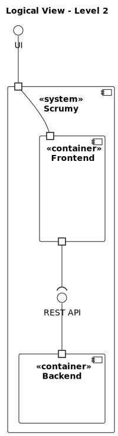
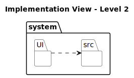
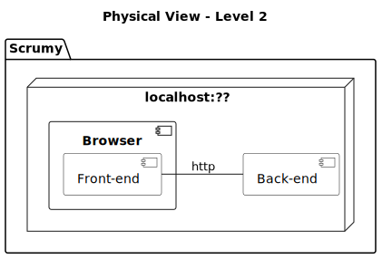
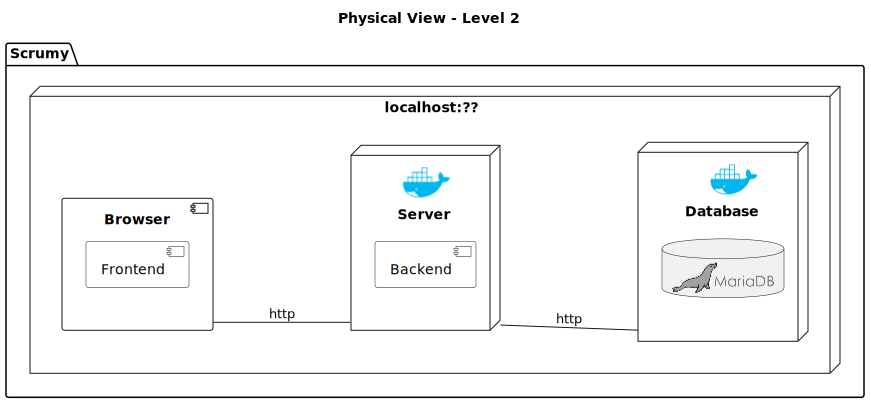
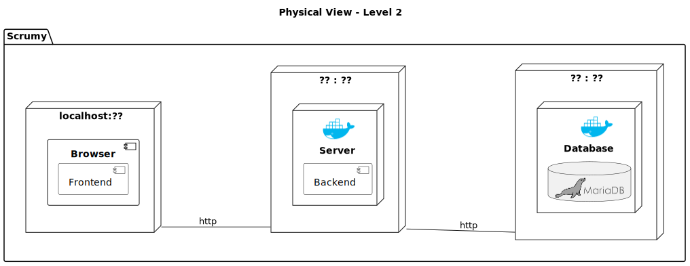
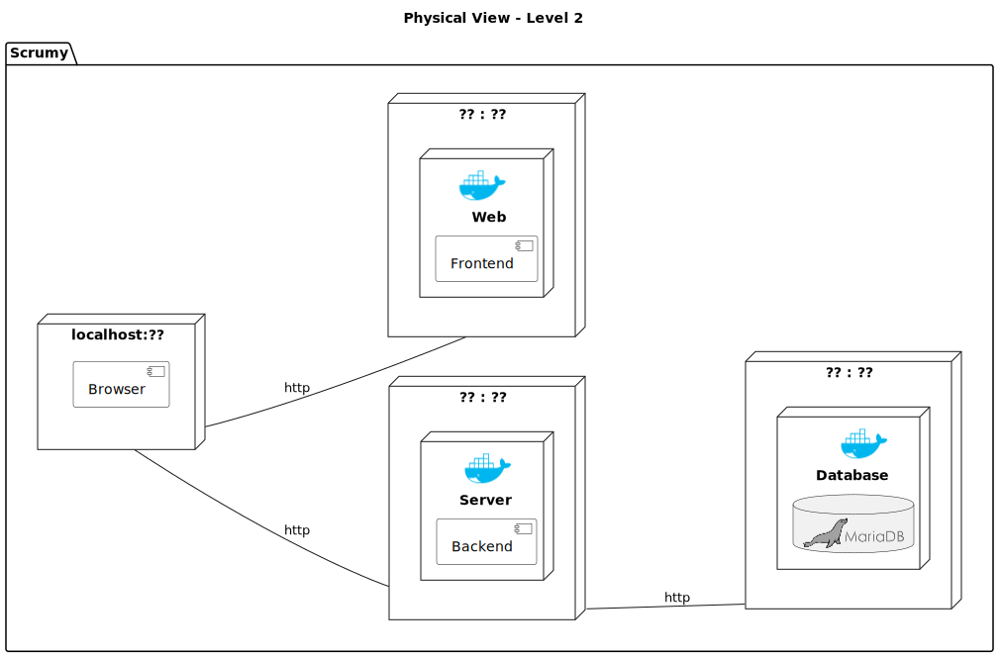
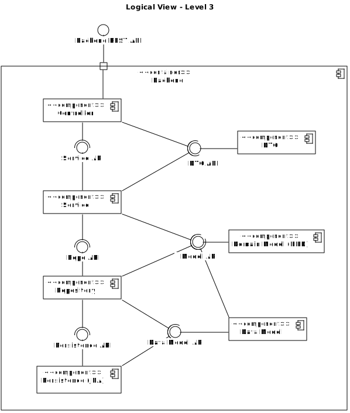
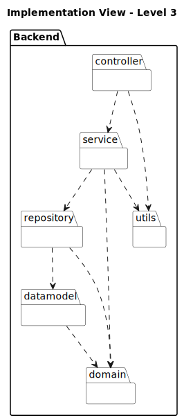
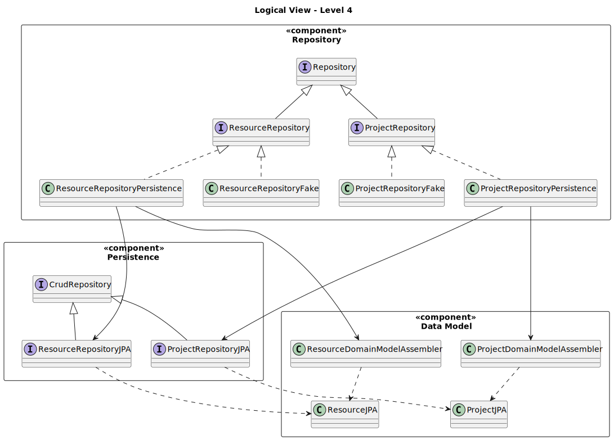

# Architecture Documentation

* Level 1
  * Logical View
* Level 2
  * Logical View
  * Implementation View
  * Physical View
* Level 3
  * Logical View
  * Implementation View
* Level 4
  * Logical View

---

## Level 1
### Logical View

## Level 2
### Logical View

### Implementation View

### Physical View
#### Before deployment: 

#### After deployment: 

## Level 3
### Logical View

### Implementation View

## Level 4
### Logical View

