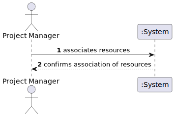
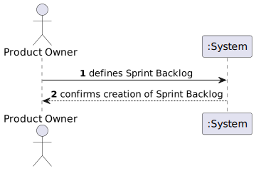
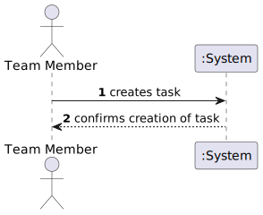

# Use Case Model

## Table of Contents
* Introduction
* System Sequence Diagram
* Index

## Introduction
This document details the System Sequence Diagrams for the User Stories identified in the overall vision document.
> **_NOTE:_** _Elements in **red** indicate that it's an assumption and not clearly stated in the vision document._

## System Sequence Diagram

### US999-1:

### US998-1:

### US997-1:

---

### US990-2:

### US989-2:

### US989-2:

### US988-2:

---

### US999-3:

### US998-3:

### US997-3:

### US996-3:

### US995-3:

---
### US994-4:

### US993-4:

### US992-4:

### US991-4:

### US990-4:

### US989-4:

### US988-4:

### US987-4:

---

### US982-5:

### US981-5:

### US980-5:

### US979-5:

### US978-5:

### US977-5:

### US976-5:

### US975-5:

## Index
| User Story | Chapter |
|------------|---------|
| US999-1    | 2.1     |
| US998-1    | 2.2.1   |
| US997-1    | 2.2.2   |
|            |         |
| US990-2    |         |
| US989-2    | 2.3.3   |
| US989-2    | 2.3.3   |
| US988-2    | 2.3.3   |
|            |         |
| US999-3    | 2.4.1   |
| US998-3    | 2.4.1   |
| US997-3    | 2.4.1   |
| US996-3    | 2.4.1   |
| US995-3    | 2.4.2   |
|            |         |
| US994-4    | 2.4.3   |
| US993-4    | 2.4.3   |
| US992-4    | 2.4.3   |
| US991-4    | 2.4.3   |
| US990-4    | 2.4.3   |
| US989-4    | 2.4.3   |
| US988-4    | 2.4.4   |
| US987-4    | 2.4.4   |
|            |         |
| US982-5    | 2.4.5   |
| US981-5    | 2.4.5   |
| US980-5    | 2.4.6   |
| US979-5    | 2.4.6   |
| US978-5    | 2.4.7   |
| US977-5    | 2.4.8   |
| US976-5    | 2.5     |
| US975-5    | 2.6     |

