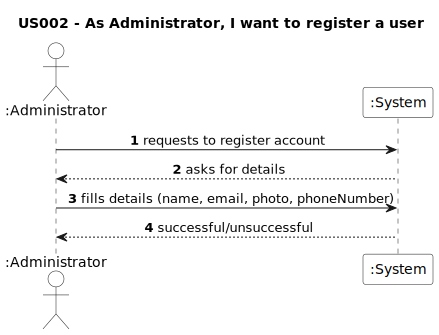
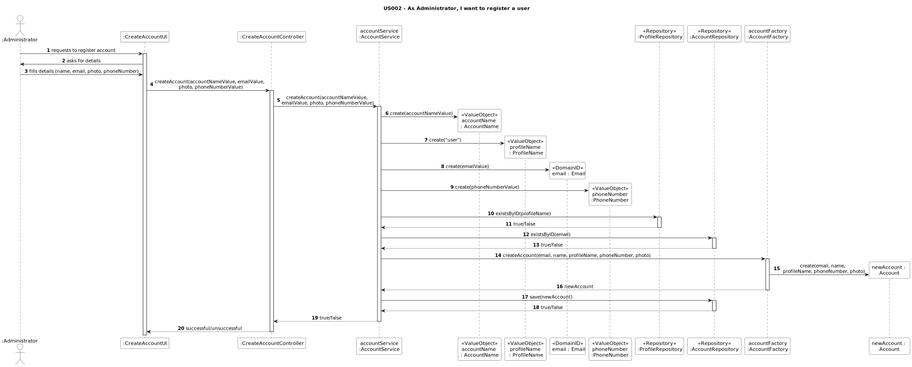
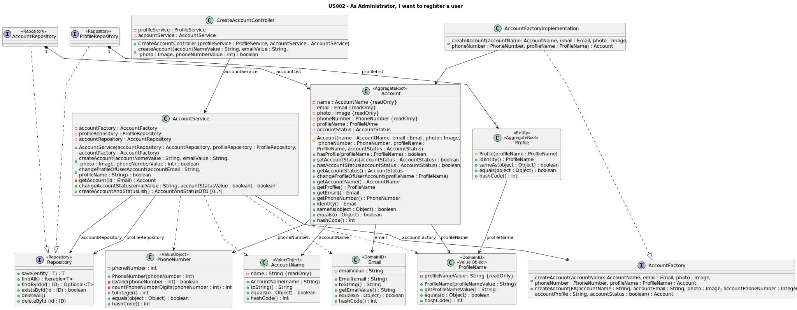

# Artifacts US002

## Introduction
This document details the UML diagrams for the artifacts of US002 implementing Domain Driven Design.

## Requirements
### System Sequence Diagram

## Design
### Sequence Diagram

### Partial Class Diagram
