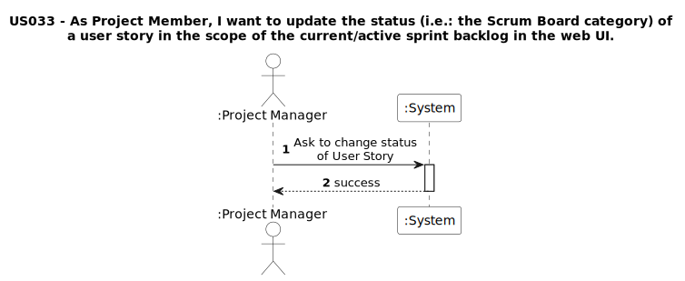
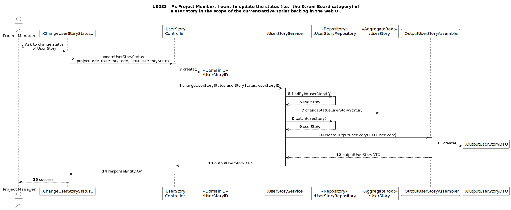
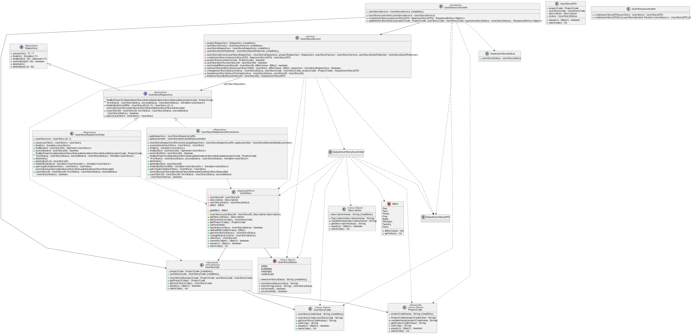
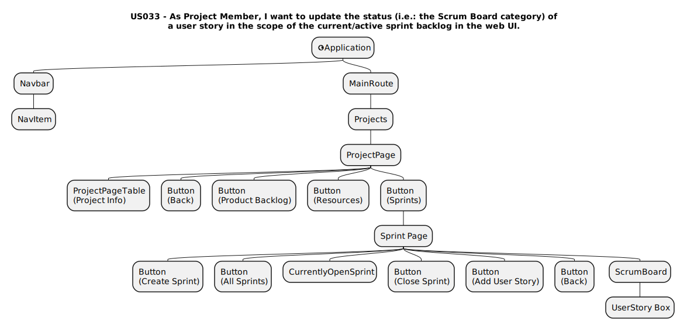
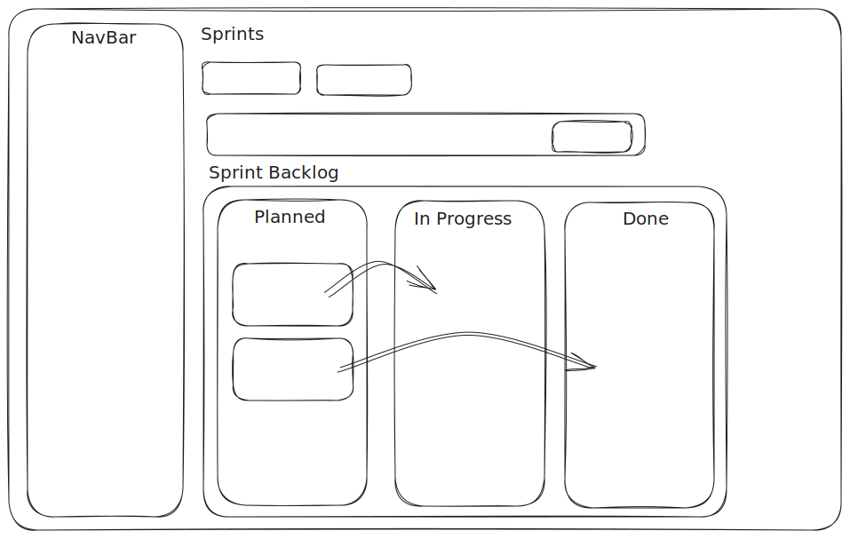
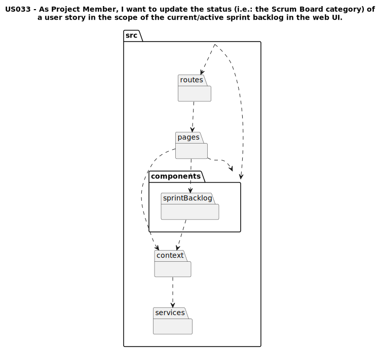

# Artifacts US033

## Introduction
This document details the UML diagrams for the artifacts of US033.

## Requirements
### System Sequence Diagram

## Design
### Sequence Diagram

### Partial Class Diagram

### Component Tree

### Mock

### Package Diagram
