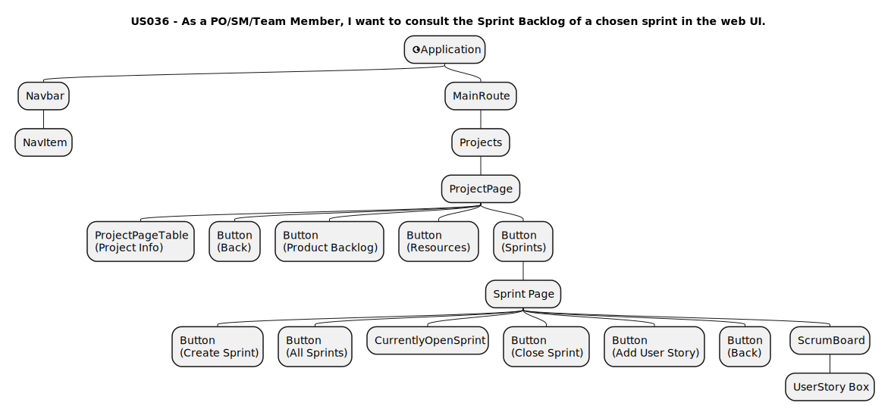
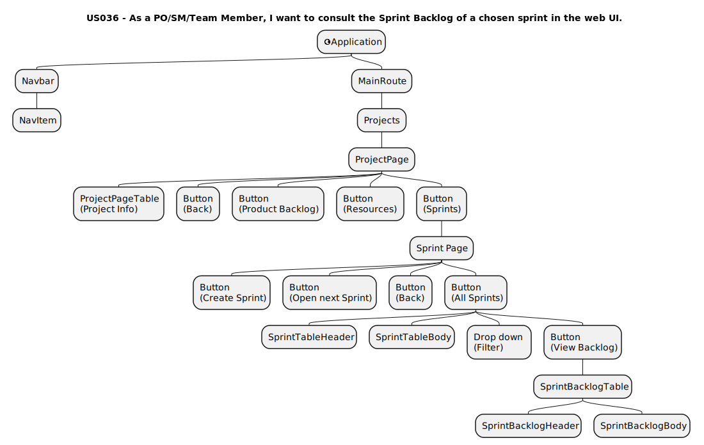
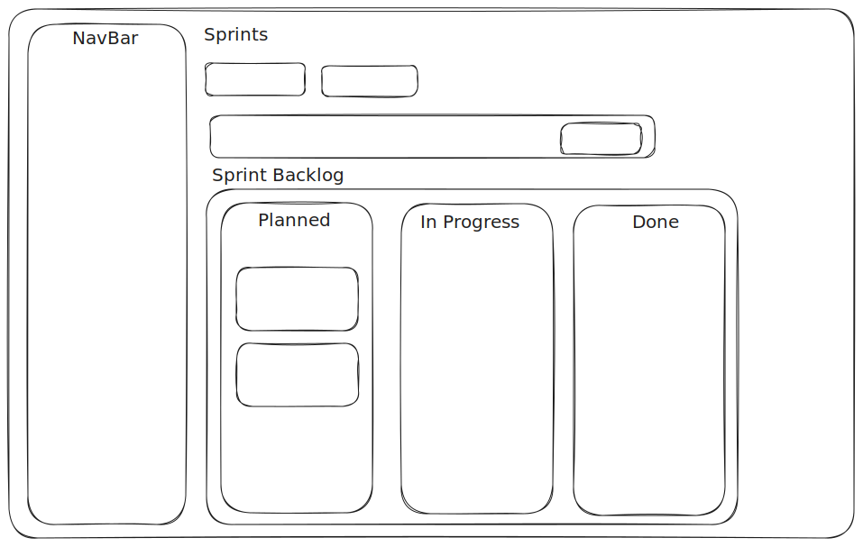
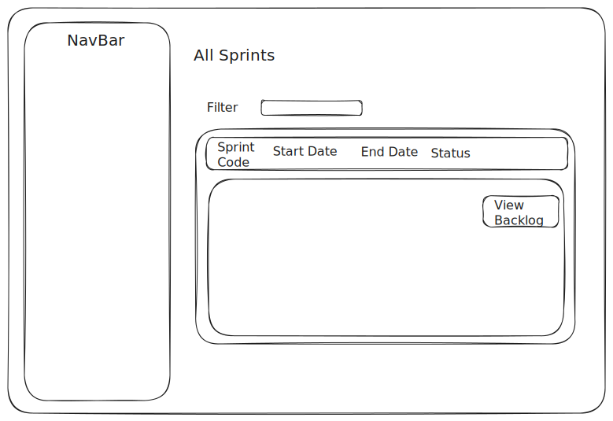
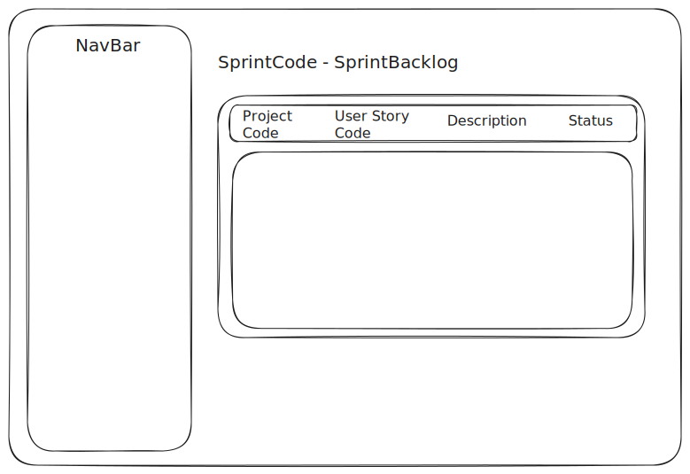
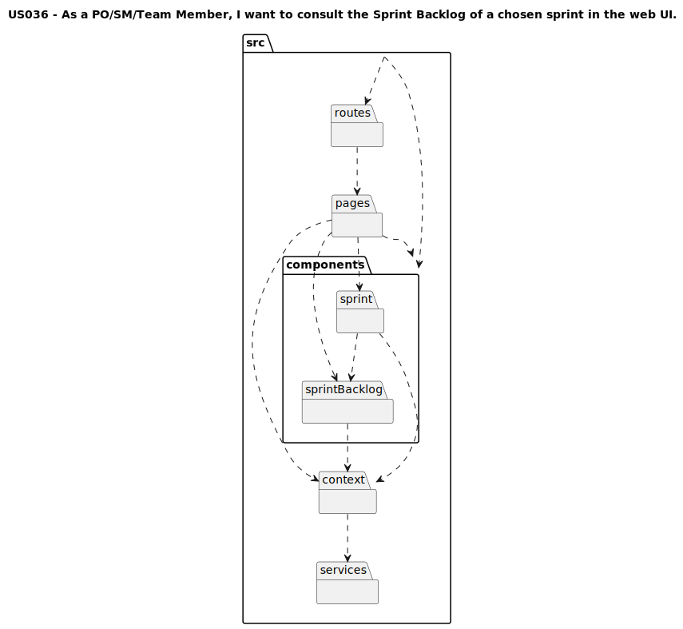

# Artifacts US036

## Introduction
This document details the UML diagrams for the artifacts of US036.

### Component Tree
#### Scrum Board

#### Sprint Backlog of closed sprint

### Mock
#### Scrum Board

#### All Sprints

#### Sprint Backlog of closed sprint

### Package Diagram
